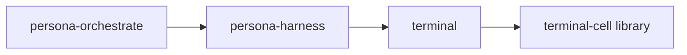

# owner-signal-terminal — architecture

*Currently named meta Signal contract for privileged Persona terminal session lifecycle.*

## 0 · TL;DR

`owner-signal-terminal` is the meta-only Signal surface for
`terminal`. It carries the requests that create or retire
terminal sessions. Those operations are privileged because they start
or stop child process state owned by the terminal component. Ordinary
terminal callers use `signal-terminal`; they cannot express
session lifecycle orders through that vocabulary.

The first owner chain is:



`persona-orchestrate` orders harness work. The harness knows adapter
shape and orders terminal session lifecycle through this meta Signal
surface. `terminal` owns the actual component state and session
processes.

## Migration history — signal-frame operation heads (2026-06-07)

The public wire carries contract-local `signal-frame` operation heads:
`CreateSession` and `RetireSession`. It does not carry Sema
classification words such as `Mutate` or `Retract`.

Daemon-side lowering from contract operation to typed Component Commands
(`CreateSession` →
`TerminalCommand::AssertSessionRecord` plus
`TerminalCommand::StartChildProcess`; `RetireSession` →
`TerminalCommand::RetractSessionRecord` plus
`TerminalCommand::StopChildProcess`) lives in the `terminal`
daemon.

Each Component Command projects to a payloadless Sema class label for
observation inside the daemon. This contract owns wire vocabulary and
codecs only.

## 1 · Contract surface

| Request | Projected Sema class | Meaning |
|---|---|---|
| `CreateSession` | `Mutate` (session-record component projection) | Install a named terminal session in `terminal` and start the configured child process. |
| `RetireSession` | `Retract` | Retire a named terminal session and return its terminal exit status when available. |

| Reply | Meaning |
|---|---|
| `SessionCreated` | The terminal daemon accepted the session and exposes the data socket path for viewers. |
| `SessionRetired` | The terminal daemon retired the session. |
| `OwnerTerminalRequestUnimplemented` | The request reached the meta surface but the current runtime path is not built yet. |

## 2 · Shared nouns

This crate imports terminal identity and status nouns from
`signal-terminal`:

- `TerminalName`
- `TerminalExitStatus`

It also uses `signal-persona::WirePath` for session data-socket paths.
It does not duplicate ordinary terminal input, capture, prompt-pattern,
or worker-lifecycle records.

## 3 · Constraints

| Constraint | Witness |
|---|---|
| Session lifecycle orders live only in the meta contract. | The ordinary `signal-terminal::TerminalRequest` enum has no `CreateSession` or `RetireSession` variants; this crate's tests round-trip both meta variants. |
| Every meta request is a contract-local verb in verb form. | Round-trip tests assert each variant's NOTA head and operation head. Sema classification is daemon-side projection only. |
| Contract code contains no runtime. | Source contains no Kameo, Tokio, storage, or socket implementation. |
| Shared terminal nouns are imported, not copied. | `src/lib.rs` uses `signal_terminal::TerminalName` and `TerminalExitStatus`. |

## 4 · Non-ownership

- No terminal daemon.
- No ordinary terminal input/capture/prompt-gate vocabulary.
- No raw PTY or viewer byte plane.
- No runtime permission enforcement.
- No sema-engine tables or reducers.

## Code map

```text
src/
└── lib.rs              — owner request/reply records and signal_channel! invocation
examples/
└── canonical.nota      — owner request/reply examples
tests/
└── round_trip.rs       — rkyv frame + NOTA + operation-head witnesses
```

## See also

- `signal-terminal/ARCHITECTURE.md`
- `terminal/ARCHITECTURE.md`
- `terminal-cell/ARCHITECTURE.md`
- `~/primary/skills/component-triad.md` §"Verbs come in three layers".
