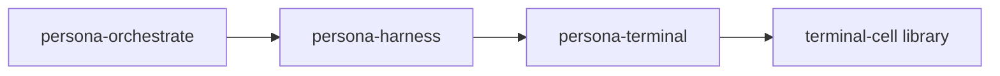

# owner-signal-persona-terminal — architecture

*OwnerSignal contract for privileged Persona terminal session lifecycle.*

## 0 · TL;DR

`owner-signal-persona-terminal` is the owner-only Signal surface for
`persona-terminal`. It carries the requests that create or retire
terminal sessions. Those operations are privileged because they start
or stop child process state owned by the terminal component. Ordinary
terminal callers use `signal-persona-terminal`; they cannot express
session lifecycle orders through that vocabulary.

The first owner chain is:



`persona-orchestrate` orders harness work. The harness knows adapter
shape and orders terminal session lifecycle through this OwnerSignal
surface. `persona-terminal` owns the actual component state and session
processes.

## MUST IMPLEMENT — signal architecture migration

This contract is migrating to contract-local verbs per
`primary/reports/designer/238-signal-architecture-redirection-contract-local-verbs.md`
and `primary/reports/designer/239-signal-architecture-migration-plan.md`.

Drop the `Mutate CreateSession` / `Retract RetireSession` wrapping.
The contract-local owner verbs are `CreateSession` and `RetireSession`
directly (already verb-form). Alternatively, lift the `Session`
suffix to the payload and use `Create` and `Retire` with payloads
named `Session` — this matches the pattern across the other
owner-signal-* crates where `Configure` carries `Configuration` and
`Register` carries `Registration`. Move verb-to-Sema lowering
(`CreateSession` → `Assert` session row plus child-process start
effect, `RetireSession` → `Retract` session row plus child-process
stop effect) into `persona-terminal`. The dependency on `signal-core`
shifts to `signal-frame`.

References: `primary/reports/designer/238-signal-architecture-redirection-contract-local-verbs.md`,
`primary/reports/designer/239-signal-architecture-migration-plan.md`.

**Note to remover:** when the refactor lands, remove this section and
add a `## Migration history — contract-local verbs (2026-05-XX)`
paragraph noting the shape change.

## 1 · Contract surface

| Request | Signal verb | Meaning |
|---|---|---|
| `CreateSession` | `Mutate` | Install a named terminal session in `persona-terminal` and start the configured child process. |
| `RetireSession` | `Retract` | Retire a named terminal session and return its terminal exit status when available. |

| Reply | Meaning |
|---|---|
| `SessionCreated` | The terminal daemon accepted the session and exposes the data socket path for viewers. |
| `SessionRetired` | The terminal daemon retired the session. |
| `OwnerTerminalRequestUnimplemented` | The request reached the owner surface but the current runtime path is not built yet. |

## 2 · Shared nouns

This crate imports terminal identity and status nouns from
`signal-persona-terminal`:

- `TerminalName`
- `TerminalExitStatus`

It also uses `signal-persona::WirePath` for session data-socket paths.
It does not duplicate ordinary terminal input, capture, prompt-pattern,
or worker-lifecycle records.

## 3 · Constraints

| Constraint | Witness |
|---|---|
| Session lifecycle orders live only in the owner contract. | The ordinary `signal-persona-terminal::TerminalRequest` enum has no `CreateSession` or `RetireSession` variants; this crate's tests round-trip both owner variants. |
| Every owner request declares a Signal root verb. | `OwnerTerminalRequest::signal_verb()` returns `Mutate` for `CreateSession` and `Retract` for `RetireSession`. |
| Contract code contains no runtime. | Source contains no Kameo, Tokio, redb, or socket implementation. |
| Shared terminal nouns are imported, not copied. | `src/lib.rs` uses `signal_persona_terminal::TerminalName` and `TerminalExitStatus`. |

## 4 · Non-ownership

- No terminal daemon.
- No ordinary terminal input/capture/prompt-gate vocabulary.
- No raw PTY or viewer byte plane.
- No runtime permission enforcement.
- No sema-engine tables or reducers.

## Code map

```text
src/
└── lib.rs              — owner request/reply records and signal_channel! invocation
examples/
└── canonical.nota      — owner request/reply examples
tests/
└── round_trip.rs       — rkyv frame + NOTA + verb mapping witnesses
```

## See also

- `signal-persona-terminal/ARCHITECTURE.md`
- `persona-terminal/ARCHITECTURE.md`
- `terminal-cell/ARCHITECTURE.md`
